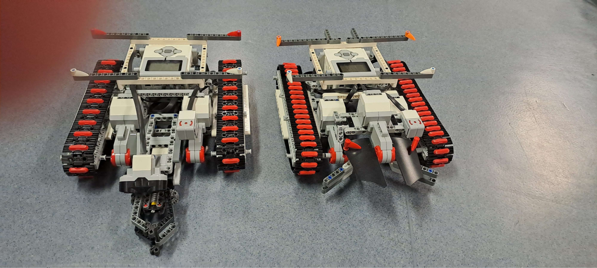
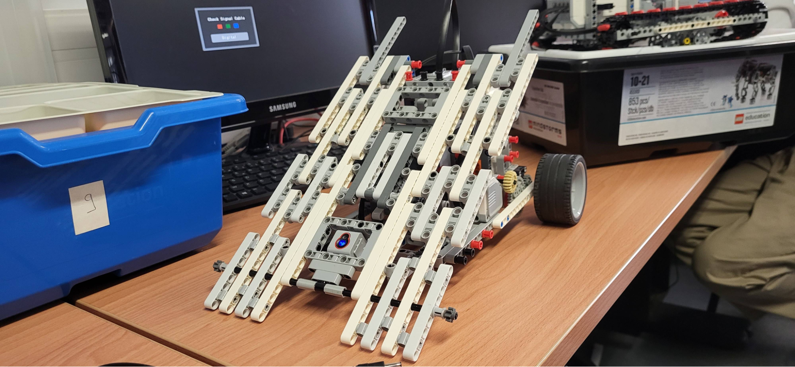
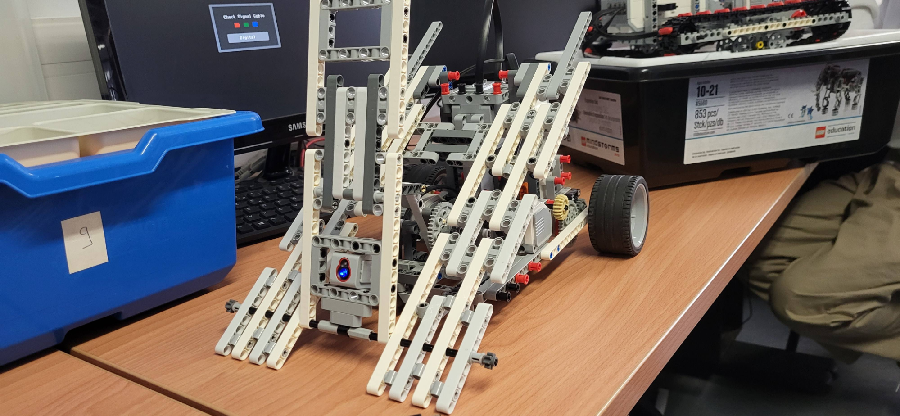
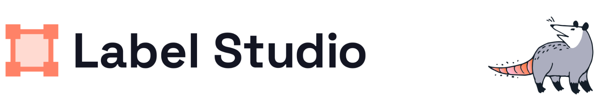
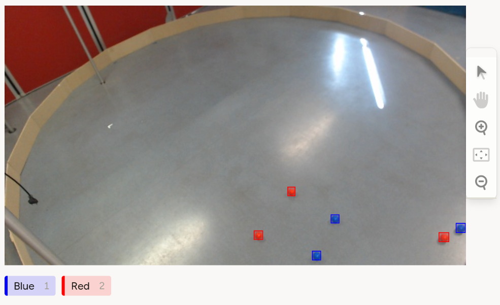
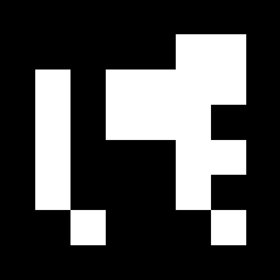

# Construction et designs des robots

## 1er Robot

	Le premier robot a un concept relativement simple, puisqu’au début, nous voulions tester assez rapidement les moteurs, les senseurs et comment leur envoyer des instructions. Ainsi, le premier robot est un robot attrapeur et est équipé d’une pince qui peut s’ouvrir et se refermer pour attraper et relâcher une balle. Il se déplace selon les instructions du serveur, et la pince se ferme lorsque le capteur ultrasonique placé juste au-dessus détecte un objet suffisamment proche. Cette dernière fonctionnalité est gérée sur le code local du robot, sans intervention du serveur.

*Photo du 1er robot*  

Pour se déplacer, le châssis du robot est monté sur des chenilles qui sont activées par deux moteurs, eux même contrôlés par une structure logique de tank dans le code du robot (cf. [Motor classes — python-ev3dev 2.1.0.post1 documentation](https://ev3dev-lang.readthedocs.io/projects/python-ev3dev/en/stable/motors.html#move-tank)). De plus, le robot est équipé d’un support au dessus de la brique EV3 pour poser la feuille de l’ArUco (cf. Vision et détection du robot). Ce support a des pins qui peuvent facilement se détacher pour maintenir la feuille en place.
Enfin, la brique EV3 est amovible, puisqu’elle est maintenue par des bras dont elle peut facilement se détacher. Elle est aussi facilement accessible, puisque son port de charge situé vers l’arrière du robot est dégagé et que son interface et ses boutons sont directement accessibles depuis le haut du robot.

##

## 2ème Robot

	L’objectif original du deuxième robot était de chercher à gêner activement les robots “adverses”. Notre approche a donc été de concevoir un robot avec une rampe. L’idée est que les autres robots montent sur la rampe, et que celle-ci pivote pour les faire basculer.

  
  

*2ème robot original avec rampe, rampe fermée et étendue*

Le robot se déplace selon les instructions du serveur, et la rampe s’active lorsque le capteur de lumière placé dedans est couvert. Cette dernière fonctionnalité était gérée sur le code local du robot, sans intervention du serveur.
Malheureusement, en testant ce robot sur notre autre construction, nous avons découvert que le moteur ne pourrait pas réussir à pousser un autre robot, et encore moins à le retourner. Le projet étant déjà avancé, nous avons décidé d’abandonner l’idée de la rampe et de faire un deuxième robot attrapeur de balle.

La version finale du 2ème robot utilise exactement le même châssis que le 1er, jusqu’au placement des moteurs, afin de pouvoir réutiliser le code du serveur et de la vision déjà développée. La différence de ce nouveau robot vient du fait qu’il attrape les balles “passivement”, avec un entonnoir vers un espace libre à l’intérieur. Cet espace peut se clore à l’aide d’une porte, censée se fermer lors des déplacements. Cette fonctionnalité a toutefois rencontré des problèmes de fonctionnement.

*2ème robot, dans sa version finale*

# Fonctionnement du projet

## Fonctionnement général du code

Sur l’ensemble des scripts que nous avons écrits, nous sommes partis sur du python avec la bibliothèque ev3dev2 qui nous a permis de gérer les déplacements des robots et d’envoyer très rapidement des commandes sur l’EV3.
De plus nous avons toujours eu à écrire 2 codes, un pour notre EV3 et un autre pour le PC.

Les premiers scripts que nous avons implémentés nous ont permis de tester les déplacements de notre robot. (trouvable dans le répertoire script\_test)
Le script côté PC sert de serveur sur lequel notre EV3 se connecte en tant que client, grâce au terminal du PC, nous pouvons envoyer des commandes que notre EV3 peut exécuter en temps réel.

## Instructions pour faire fonctionner le projet

### 1\. Installation des dépendances Python (côté PC)

Pour faire fonctionner le projet sur le PC, il est nécessaire d’installer plusieurs modules Python :
OpenCV (traitement d’images et détection ArUco)
	NumPy
	Ultralytics (modèle YOLO pour la détection des balles)
	Logging (pour l’affichage avancé des logs et du debug)

Installation en ligne de commande :
Comme nous avons utilisé python, il est nécessaire d’installer toutes les bibliothèques présentes sur les scripts via : *pip install opencv-python numpy ultralytics logging torch*

### 2\. Configuration du client PC (vision et contrôle)

Dans le script côté PC, quelques paramètres sont à ajuster :

Couleur des balles ciblées :

TARGET\_BALL\_CLASS\_ID \= 0   \# 0 \= balle bleue, 1 \= balle rouge

Zone de dépôt :
DEPOSIT\_ZONE \= \[100, 100, 200, 200\]  \# \[x1, y1, x2, y2\]
Ce sont les coordonnées en pixels de la zone où les balles doivent être déposées. Adaptez-les à la taille et à la résolution de votre fenêtre vidéo.
Identifiant du robot (balise ArUco) :
ROBOT\_ARUCO\_ID \= 1  \# Mettre l'ID correspondant à votre robot (ex : 1 ou 2\)

Mode débug (optionnel) :

DEBUG\_MODE \= True

Activez cette option pour afficher sur la vidéo l’historique et les transitions d’états (par exemple : grab, approach...).

Adresses IP et ports à renseigner :

camera\_ip \= "192.168.1.193"   \# IP pour recevoir le flux vidéo
camera\_port \= 8080
ev3\_ip \= "192.168.137.29" 	\# IP du robot Lego EV3 ciblé
ev3\_port \= 25001

Ces paramètres doivent correspondre à la configuration matérielle réelle.

### 3\. Préparation des robots LEGO EV3 (côté serveur)

Vérifiez la connexion de chaque moteur et capteur sur les bons ports :

porte \= LargeMotor('outD')
roue1 \= LargeMotor('outB')
roue2 \= LargeMotor('outC')
TankDrive \= MoveTank('outB', 'outC')

Adresse IP et port du serveur

La variable HOST dans le script du robot EV3 doit correspondre à l’adresse IP réelle du robot sur le réseau. Le PORT doit être le même que celui renseigné dans le script du PC.

Exemple :

HOST \= "192.168.137.29"
PORT \= 25001

Chaque robot sur le réseau doit avoir une adresse IP et un port unique. Le script du PC doit cibler l’IP et le port correspondant à chaque robot.

## Fonctionnement de la vision

### Vision et détection des balles

Pour la partie vision de notre projet, nous avons choisi de développer un modèle de reconnaissance d’image basé sur l’apprentissage automatique. Nous avons d’abord recueilli plus de 100 images avec un outil que nous avons développé (voir script\_test/screenshot\_.py sur la forge), lequel permet de diviser en deux la “frame” de retour des caméras dès que la touche “q” est pressée. Cela nous donne ainsi, à chaque prise, deux photos correspondant chacune à l’un des deux angles de vue des caméras.

Ensuite, nous avons utilisé l’application LabelStudio pour annoter les données : sur chaque image, nous indiquons précisément la position des balles rouges et des balles bleues. Ces images annotées sont ensuite envoyées sur Google Colab, qui nous permet d’accéder gratuitement à un GPU afin d’entraîner notre modèle de détection.
  
Enfin, dans notre code exécuté sur le PC, nous utilisons l’algorithme de détection d’objets en temps réel YOLO (You Only Look Once). Ce modèle nous permet de détecter très précisément la position des balles dans l’arène à partir des flux vidéo récupérés, offrant ainsi aux robots les informations de localisation nécessaires pour accomplir leur tâche.

### Vision et détection des robots

Pour différencier et localiser précisément chaque robot dans l’arène, nous avons placé un marqueur ArUco sur chacun d’eux, avec respectivement les identifiants 1 et 2\.
Les marqueurs ArUco sont similaires aux QR codes, mais ils sont conçus spécifiquement pour la détection rapide et fiable par ordinateur : ils comportent une matrice binaire leur attribuant un identifiant unique, ce qui permet de distinguer plusieurs robots en même temps.

  

Grâce à la bibliothèque ArUco intégrée à OpenCV, le système détecte automatiquement la présence et l’identifiant de chaque marqueur sur les images issues des caméras.
Cela nous donne la position et l’orientation précise de chaque robot dans l’arène.

Une fois que le robot est localisé, notre code PC lui permet de sélectionner une balle à traquer et de lui indiquer comment l’atteindre.

## Comportement des robots

Nous avons dû adapter l’architecture client-serveur afin d’intégrer le comportement des robots ainsi que la détection précédemment expliquée. Étant donné que le PC s’occupe de la capture et de l’analyse vidéo (détection d’objets, traitement d’image, etc.), il sera le cerveau qui calcule et détecte tout. L’EV3, quant à lui, se contente d’exécuter les instructions qu’il reçoit (comme avancer, tourner, s’arrêter, etc.). Il nous a donc semblé logique d’inverser les rôles en considérant l’EV3 comme serveur (réceptif aux commandes) et le PC comme client (émetteur des commandes après traitement) pour notre script final.

Afin de créer des commandes plus complexes pour notre robot nous avons choisi de créer un automate à états représentant notre robot.

Les différents états et leurs transitions sont les suivants :

- Search : le robot cherche une balle, il calcule son angle via le marqueur Aruco et la position du robot et de la balle. Il se déplace ensuite vers la balle et change d’état (approach)
- Approach : le robot a trouvé une balle et se déplace vers elle tant qu’il a une vision dessus puis bascule à l’état grab si il est proche. (sinon il repasse dans l’état search)
- Grab : le robot essaie d’attraper la balle.
- To deposit : le robot a récupéré la balle et se déplace donc vers la zone de dépôt.
- Done : le robot a fini sa tâche, après un certain temps il repasse en mode search.

Voici quelques une liste des comportements/fonctionnalités que nous avons ajoutés au script :

- Automate Robot : nous avons fait en sorte que le PC ordonne au robot d’avancer lorsque son Aruco n’est plus visible à la caméra, ce qui nous a permis de rendre plus robuste la détection d’Aruco.
- Interface côté PC : nous avons rajouté une interface de debug au-dessus de l’affichage de la caméra, il nous permet de voir si le robot et les balles sont bien détectés mais aussi de voir l’angle, la trajectoire et l’état de notre robot.
- Détection autonome sur EV3 : le robot muni d’une pince permet de détecter de lui-même la présence ou non d’une balle dans sa pince et d’avertir le PC.

##

## Expérimentation avec le Raspberry Pi

Nous avons initialement envisagé d’utiliser un Raspberry Pi afin d’alléger la charge sur le réseau et de faciliter la communication entre les robots et le PC (chargé de la vision). L’idée était de créer un réseau Wi-Fi dédié avec le Raspberry Pi, auquel seraient connectés les robots EV3 et l’ordinateur principal. Le PC était relié en filaire aux caméras pour la récupération du flux vidéo, et en Wi-Fi au Raspberry Pi, qui servait de relais.

Concrètement, le traitement d’image (par exemple : détecter et localiser une balle bleue) se faisait sur le PC de vision, puis l’instruction était transmise au Raspberry Pi, qui la relayait ensuite aux robots LEGO EV3 connectés au même réseau.

Cette architecture permettait de mieux gérer la bande passante et d’assurer une communication plus stable entre tous les éléments du système.

Finalement, suite à l’autorisation d’utiliser directement nos ordinateurs pour la gestion du réseau, nous avons opté pour une solution plus simple : le PC de vision joue désormais aussi le rôle de point d’accès Wi-Fi. Les robots s’y connectent directement, ce qui supprime l’étape intermédiaire du Raspberry Pi et simplifie la configuration réseau. Bien que la solution avec le Raspberry Pi ait fonctionné en fin de développement, nous avons préféré garder une architecture plus directe.
